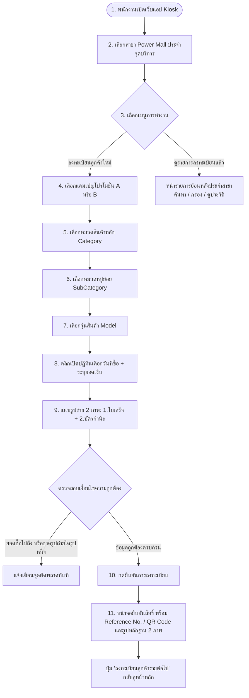

# ระบบลงทะเบียนรับบัตรกำนัล Power Mall x Haier (Voucher Registration for Power Mall)
**Document Version:** 2.4.0 (Updated: Interactive Visual Calendar Picker for Date of Purchase)  
**Target Platform:** Cloudflare Pages + Workers + D1 Database + R2 Object Storage  
**Brand Design System:** Haier Electric Thailand & Power Mall (The Mall Group)

---

## 1. ภาพรวมระบบและข้อกำหนดหลัก (Executive Overview)

ระบบ **Voucher Registration for Power Mall** เป็นเว็บแอปพลิเคชันสำหรับ **พนักงานขาย (PC/Promoter) ณ ห้างสรรพสินค้า Power Mall (เครือ The Mall Group)** เพื่อลงทะเบียนการซื้อสินค้าแบรนด์ Haier ของลูกค้า ตรวจสอบสิทธิ์โปรโมชั่นแบบ Real-time แนบหลักฐานภาพถ่าย 2 รายการ และออกรหัสบัตรกำนัล (Voucher Reference Code / QR Code) ให้แก่ลูกค้าเพื่อนำไปแสดงรับของรางวัลได้ทันที

### ไฮไลต์ฟังก์ชันสำคัญล่าสุด (Latest Features)
1. **Interactive Visual Calendar Picker (ปฏิทินเลือกวันที่ซื้อสินค้า):**
   - ช่อง `วันที่ซื้อสินค้า (Date of purchase)` มาพร้อม **ปฏิทิน Pop-up แบบโต้ตอบ (Flatpickr Theme: Haier Dark UI)**
   - คลิกที่ช่องกรอกหรือไอคอนปฏิทินเพื่อเปิดหน้าต่างปฏิทินภาษาไทย เลือกวัน เดือน และปีได้อย่างสะดวก
   - แสดงผลวันที่ในรูปแบบที่อ่านง่าย เช่น `21 สิงหาคม 2026 (วันศุกร์)` พร้อมจัดเก็บข้อมูลในรูปแบบมาตรฐาน `YYYY-MM-DD`
   - กำหนดค่าเริ่มต้นเป็นวันปัจจุบันอัตโนมัติ และป้องกันการเลือกวันที่ในอนาคต (`maxDate: today`)
2. **Dual Picture Uploads (แนบหลักฐานภาพถ่าย 2 รายการ):**
   - **ภาพที่ 1 - รูปถ่ายใบเสร็จรับเงิน (Receipt Photo):** แสดงวันที่ซื้อ, สาขา, และยอดเงินรวม
   - **ภาพที่ 2 - รูปถ่ายบัตรกำนัลที่มอบให้ลูกค้า (Voucher Photo):** บัตรเติมน้ำมัน PTT หรือ บัตร The Mall Gift Voucher
3. **3-Level Cascading Product Selector (Category → SubCategory → Model):**
   - กรองรุ่นสินค้าตามหมวดหลัก (6 หมวด) และหมวดย่อยอย่างแม่นยำจากฐานข้อมูล 415 รุ่น

---

## 2. แคมเปญที่เปิดใช้งานและภาพโปรโมชั่น (Active Campaigns & Visual Assets)

### 📌 Campaign A: "เย็นฉ่ำ แล้วยังเติมความสุขให้ทุกเส้นทาง" (Haier x PTT)


| หัวข้อ | รายละเอียด |
| :--- | :--- |
| **รหัสแคมเปญ** | `CAMP-2026-PTT-AC` |
| **ระยะเวลาโปรโมชั่น** | วันนี้ – 31 สิงหาคม 2569 |
| **ของรางวัล** | **บัตรเติมน้ำมัน PTT Privilege Card มูลค่า 500 บาท** (Flat Reward) |
| **เงื่อนไขสินค้า** | ซื้อเครื่องปรับอากาศ Haier เฉพาะ **4 รุ่นที่ร่วมรายการ** (Category: `AC` / SubCategory: `Inverter`):<br>1. `HSU-09VRRA055BF` (UV Cool Smart 9,200 BTU)<br>2. `HSU-12VRRA05BF` (UV Cool Smart 12,300 BTU)<br>3. `HSU-18VRRA05BF` (UV Cool Smart 18,000 BTU)<br>4. `HSU-12VQEC05` (Clean Cool 12,000 BTU) |
| **สาขาที่ร่วมรายการ** | **ทุกสาขา Power Mall ที่เปิดให้บริการ (All Active Stores)** |
| **หลักฐานที่ต้องแนบ (2 ภาพ)** | 1. รูปถ่ายใบเสร็จรับเงิน<br>2. รูปถ่ายบัตรเติมน้ำมัน PTT 500 บาทที่ส่งมอบให้ลูกค้า |

---

### 📌 Campaign B: "Shop More Get More" (Haier x LFC x PSG)


| หัวข้อ | รายละเอียด |
| :--- | :--- |
| **รหัสแคมเปญ** | `CAMP-2026-SPORTS-MALL` |
| **ระยะเวลาโปรโมชั่น** | 22 สิงหาคม 2569 – 30 กันยายน 2569 |
| **ของรางวัล** | **Gift Voucher The Mall มูลค่า 1,000 บาท** (เมื่อซื้อครบ 20,000 บาทขึ้นไป) |
| **เงื่อนไขสินค้า** | ซื้อเครื่องใช้ไฟฟ้า Haier **ทุกหมวดหมู่/ทุกประเภทย่อย/ทุกรุ่น (All 415 Models)** ยอดสุทธิในใบเสร็จรวม **≥ 20,000 บาท** |
| **สาขาที่ร่วมรายการ** | **เฉพาะ 2 สาขาเท่านั้น:**<br>1. `PM:SIAM_PARAGON` (Store ID: `S00449`) - สยามพารากอน<br>2. `PM:EMPORIUM` (Store ID: `S00327`) - เอ็มโพเรียม<br>*(ระบบทำการ Lock และ Grey-out แคมเปญนี้โดยอัตโนมัติหากเลือกสาขาอื่น)* |
| **หลักฐานที่ต้องแนบ (2 ภาพ)** | 1. รูปถ่ายใบเสร็จรับเงินยอดรวมตั้งแต่ 20,000 บาทขึ้นไป<br>2. รูปถ่ายบัตร The Mall Gift Voucher 1,000 บาทที่ส่งมอบให้ลูกค้า |

---

## 3. ข้อมูลมิติสาขาและโครงสร้างสินค้า (Dimension Data)

### 3.1 ข้อมูลมิติสาขา (Dimension Store)

| STORE_ID | STORE_NAME | Store Name TH | Province TH | Region TH | Active Status | Campaign B Eligible |
| :--- | :--- | :--- | :--- | :--- | :---: | :---: |
| `S00449` | `PM:SIAM_PARAGON` | สยามพารากอน | กรุงเทพมหานคร | กรุงเทพฯและภาคกลาง | **Active** | ✅ ใช่ |
| `S00327` | `PM:EMPORIUM` | เอ็มโพเรียม | กรุงเทพมหานคร | กรุงเทพฯและภาคกลาง | **Active** | ✅ ใช่ |
| `S00222` | `PM-NAKHONRATCHASIMA` | เดอะมอลล์ โคราช | นครราชสีมา | ภาคตะวันออกเฉียงเหนือ | **Active** | ❌ ไม่ใช่ |
| `S00349` | `PM:NGAMWONGWAN` | เดอะมอลล์ งามวงศ์วาน | นนทบุรี | กรุงเทพฯและภาคกลาง | **Active** | ❌ ไม่ใช่ |
| `S00370` | `PM:THAPRA` | เดอะมอลล์ ท่าพระ | กรุงเทพมหานคร | กรุงเทพฯและภาคกลาง | **Active** | ❌ ไม่ใช่ |
| `S00190` | `PM:BANGKAE` | เดอะมอลล์ บางแค | กรุงเทพมหานคร | กรุงเทพฯและภาคกลาง | **Active** | ❌ ไม่ใช่ |
| `S00066` | `PM:BANGKAPI` | เดอะมอลล์ บางกะปิ | กรุงเทพมหานคร | กรุงเทพฯและภาคกลาง | **Active** | ❌ ไม่ใช่ |
| `S00795` | `PM:RAMKAMHANG` | เดอะมอลล์ รามคำแหง | กรุงเทพมหานคร | กรุงเทพฯและภาคกลาง | **Not active** | ❌ ไม่ใช่ |

---

### 3.2 โครงสร้าง Category & SubCategory (415 SKUs)

| หมวดหมู่หลัก (Category) | หมวดหมู่ย่อย (SubCategory) | รายละเอียด / ตัวอย่างสินค้า | จำนวนรุ่น |
| :--- | :--- | :--- | :---: |
| **AC (เครื่องปรับอากาศ)** | Inverter | แอร์ระบบอินเวอร์เตอร์ ประหยัดไฟเบอร์ 5 (รวม 4 รุ่นแคมเปญ A) | 71 รุ่น |
| | Fix Speed | แอร์ระบบธรรมดา ทำความเย็นคงที่ | 18 รุ่น |
| | Floor Standing | แอร์แบบตู้ตั้งพื้นขนาดใหญ่ | 1 รุ่น |
| **RF (ตู้เย็น)** | Multi Dr | ตู้เย็นมัลติดอร์ 4 ประตูขึ้นไป | 16 รุ่น |
| | SBS | ตู้เย็น Side-by-Side 2 ประตูแนวตั้ง | 6 รุ่น |
| | 2Dr | ตู้เย็น 2 ประตู ช่องฟรีซบน | 30 รุ่น |
| | 1Dr | ตู้เย็น 1 ประตู ขนาดกะทัดรัด | 16 รุ่น |
| | BM | ตู้เย็น Bottom Mount ช่องฟรีซล่าง | 2 รุ่น |
| **WM (เครื่องซักผ้า/อบผ้า)** | FL Wash&Dry | เครื่องซักผ้าฝาหน้าพร้อมฟังก์ชันอบผ้า | 11 รุ่น |
| | Front Load | เครื่องซักผ้าฝาหน้า | 19 รุ่น |
| | Top Load | เครื่องซักผ้าฝาบนอัตโนมัติ | 27 รุ่น |
| | Twin Tub | เครื่องซักผ้า 2 ถังกึ่งอัตโนมัติ | 14 รุ่น |
| | Dryer | เครื่องอบผ้าฝาหน้า | 6 รุ่น |
| **TV (โทรทัศน์)** | OLED | พรีเมียม OLED TV 4K 120Hz | 1 รุ่น |
| | MINI-LED | Mini-LED 4K Google TV | 5 รุ่น |
| | QLED | QLED 4K Google TV สมาร์ททีวี | 25 รุ่น |
| | UHD | 4K UHD Smart TV | 21 รุ่น |
| | FHD | Full HD / Android TV | 22 รุ่น |
| **FZ (ตู้แช่แข็ง/ไวน์)** | Beverage | ตู้แช่เครื่องดื่ม 1-3 ประตู | 17 รุ่น |
| | Chest | ตู้แช่แข็งฝาทึบระบบ Dual Freeze | 35 รุ่น |
| | Vertical | ตู้แช่แข็งแนวตั้งแบบชั้น | 4 รุ่น |
| | Wine | ตู้แช่ไวน์ระบบคอมเพรสเซอร์เงียบ | 7 รุ่น |
| | Glass | ตู้แช่ฝากระจกโค้ง/กระจกใส | 6 รุ่น |
| **WH (เครื่องทำน้ำอุ่น/ตู้น้ำ)** | Digital | เครื่องทำน้ำอุ่นระบบดิจิทัล หน้าจอดิจิทัล | 13 รุ่น |
| | Manual | เครื่องทำน้ำอุ่นระบบลูกบิดแมนนวล | 20 รุ่น |
| | Water Dispenser | ตู้น้ำดื่มร้อน-เย็น ถังน้ำด้านล่าง | 2 รุ่น |
| **รวมทั้งหมด** | | | **415 รุ่น** |

---

## 4. โครงสร้างฐานข้อมูล (Database Schema - Cloudflare D1 / SQLite)

```sql
-- 1. ตารางมิติสาขา (Dimension Store)
CREATE TABLE IF NOT EXISTS dimension_store (
    store_id TEXT PRIMARY KEY,
    store_name TEXT NOT NULL,
    store_name_th TEXT NOT NULL,
    customer_name TEXT DEFAULT 'เพาเวอร์มอลล์',
    store_id_customer TEXT,
    province_th TEXT NOT NULL,
    region_th TEXT NOT NULL,
    is_active INTEGER DEFAULT 1,
    created_at DATETIME DEFAULT CURRENT_TIMESTAMP,
    updated_at DATETIME DEFAULT CURRENT_TIMESTAMP
);

-- 2. ตารางมิติสินค้า (Dimension Model)
CREATE TABLE IF NOT EXISTS dimension_model (
    model_code TEXT PRIMARY KEY,
    brand TEXT NOT NULL DEFAULT 'Haier',
    category TEXT NOT NULL,     -- AC, RF, WM, TV, FZ, WH
    sub_category TEXT NOT NULL, -- Inverter, Front Load, QLED, Beverage, etc.
    is_active INTEGER DEFAULT 1,
    remark TEXT,
    update_by TEXT DEFAULT 'admin',
    updated_at DATETIME DEFAULT CURRENT_TIMESTAMP
);

-- 3. ตารางแคมเปญ (Campaigns)
CREATE TABLE IF NOT EXISTS campaigns (
    campaign_id TEXT PRIMARY KEY,
    name_th TEXT NOT NULL,
    name_en TEXT NOT NULL,
    badge_label TEXT,
    start_date DATE NOT NULL,
    end_date DATE NOT NULL,
    eligible_store_ids TEXT,    -- JSON Array เช่น ["S00449", "S00327"] หรือ NULL
    fixed_category TEXT,        -- เช่น 'AC' สำหรับแคมเปญ A หรือ NULL
    fixed_sub_category TEXT,    -- เช่น 'Inverter' สำหรับแคมเปญ A หรือ NULL
    eligible_model_codes TEXT,  -- JSON Array เช่น ["HSU-09VRRA055BF", ...] หรือ NULL
    min_spend_thb REAL DEFAULT 0,
    reward_name TEXT NOT NULL,
    reward_value_thb REAL NOT NULL,
    reward_image_url TEXT,
    terms_conditions_th TEXT,
    is_active INTEGER DEFAULT 1,
    created_at DATETIME DEFAULT CURRENT_TIMESTAMP
);

-- 4. ตารางบันทึกการลงทะเบียน (Submissions / Vouchers)
CREATE TABLE IF NOT EXISTS submissions (
    submission_id TEXT PRIMARY KEY, -- Format: 'HR-YYYYMMDD-XXXX' (Voucher Reference No.)
    store_id TEXT NOT NULL,
    campaign_id TEXT NOT NULL,
    customer_name TEXT NOT NULL,
    customer_phone TEXT NOT NULL,
    category TEXT NOT NULL,          -- หมวดหลัก เช่น TV
    sub_category TEXT NOT NULL,      -- หมวดย่อย เช่น OLED
    model_code TEXT NOT NULL,        -- รุ่นสินค้า เช่น H65C900UX
    purchase_date DATE NOT NULL,     -- วันที่ซื้อตามใบเสร็จ (YYYY-MM-DD)
    purchase_amount_thb REAL NOT NULL,
    receipt_photo_url TEXT NOT NULL, -- 1. รูปถ่ายใบเสร็จรับเงิน ใน Cloudflare R2
    voucher_photo_url TEXT NOT NULL, -- 2. รูปถ่ายบัตรกำนัลที่มอบให้ลูกค้า ใน Cloudflare R2
    staff_name TEXT,
    staff_emp_id TEXT,
    voucher_status TEXT DEFAULT 'issued' CHECK(voucher_status IN ('pending', 'issued', 'rejected', 'redeemed')),
    voucher_code TEXT UNIQUE,
    redeemed_at DATETIME,
    admin_remark TEXT,
    submitted_at DATETIME DEFAULT CURRENT_TIMESTAMP,
    FOREIGN KEY(store_id) REFERENCES dimension_store(store_id),
    FOREIGN KEY(campaign_id) REFERENCES campaigns(campaign_id)
);

CREATE INDEX IF NOT EXISTS idx_sub_store ON submissions(store_id);
CREATE INDEX IF NOT EXISTS idx_sub_campaign ON submissions(campaign_id);
CREATE INDEX IF NOT EXISTS idx_sub_phone ON submissions(customer_phone);
CREATE INDEX IF NOT EXISTS idx_sub_purchase_date ON submissions(purchase_date);
```

---

## 5. แผนผังการทำงานของผู้ใช้งาน (Kiosk User Journey)



---

## 6. เอกสารแนบและไฟล์อ้างอิงในระบบ (Attached Reference Files)
- **เว็บแอปพลิเคชันพร้อมใช้งาน:** `index.html` (พร้อมปฏิทินเลือกวันที่แบบโต้ตอบ, แนบ 2 ภาพ & 3-Level Dropdown)
- **รูปภาพโปสเตอร์ Campaign A (Haier x PTT):** `Ad AC PTT vc.png`
- **รูปภาพโปสเตอร์ Campaign B (Shop More Get More):** `Ad PM vc.jpg`
- **ไฟล์ข้อมูลสาขา (Dimension Store):** `Dimension Store.csv` / `Dimension Store.json`
- **ไฟล์ข้อมูลรุ่นสินค้า (Dimension Model):** `Dimension Model.csv` / `Dimension Model.json`
